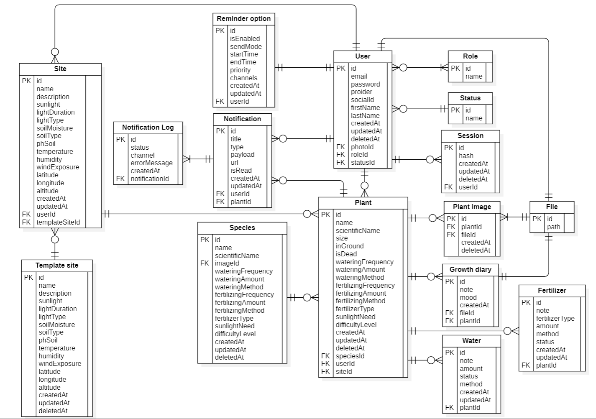

# 🌱 Plant Care Tracker

Ứng dụng **Plant Care Tracker** giúp bạn quản lý và chăm sóc cây trồng thông minh hơn.  
Theo dõi lịch tưới, bón phân, thay chậu và các hoạt động khác một cách dễ dàng, kèm theo nhắc nhở tự động.

---

## 🚀 Tính năng chính

- **Theo dõi cây trồng**: Lưu thông tin chi tiết về từng loại cây, vị trí trồng, tình trạng hiện tại.
- **Nhắc việc thông minh**: Hệ thống gợi ý và nhắc nhở lịch tưới/bón phân dựa trên loại cây + khí hậu + thói quen. (Đang phát triển)
- **Hỗ trợ IoT / Cảm biến**: Nhập dữ liệu độ ẩm, ánh sáng thủ công hoặc kết nối cảm biến. (Đang phát triển)
- **Nhận diện cây bằng ảnh (AI nhẹ)**: Gợi ý tên loài và hướng dẫn chăm sóc nhanh. (Đang phát triển)
- **UI/UX hiện đại**: Thiết kế tối giản, thao tác nhanh gọn, hỗ trợ **dark mode** và đa ngôn ngữ

---

### Cấu trúc

